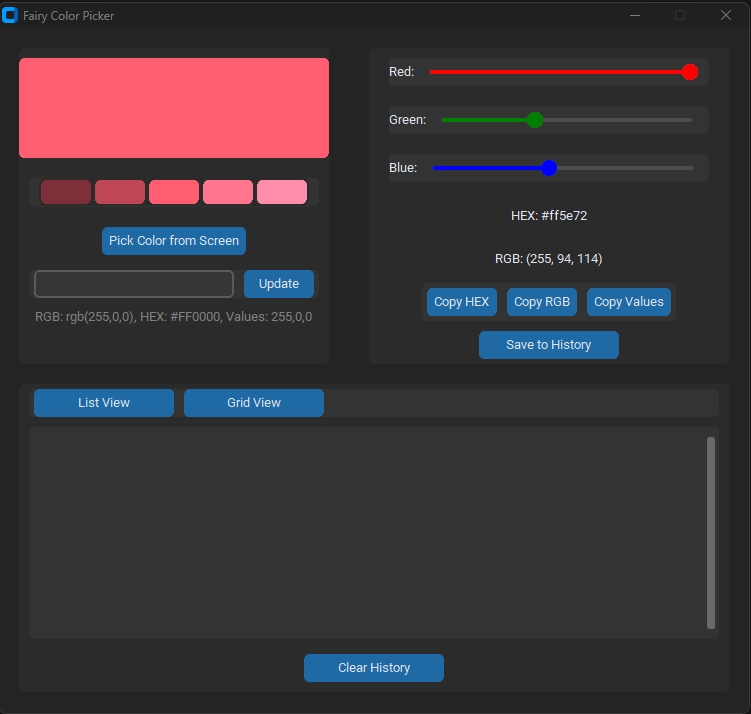

# Fairy Color Picker

<div align="center">
  
</div>

A sleek and modern color picker application built with CustomTkinter, featuring a user-friendly interface and advanced color manipulation capabilities.

<div align="center">
  
</div>

## Features

### Color Selection

- Multiple input methods:
  - RGB sliders with real-time preview and value display
  - Direct text input supporting multiple formats:
    - HEX codes (e.g., #FF0000)
    - RGB format (e.g., rgb(255,0,0))
    - Comma-separated values (e.g., 255,0,0)
  - Screen color picker tool (eyedropper)
- Real-time color preview
- Five automatically generated shades for each color
- Copy functionality for:
  - HEX color codes
  - RGB values
  - Comma-separated values

### System Integration

- System tray integration with color preview
- Customizable keyboard shortcuts
- Multiple preset shortcuts available:
  - ctrl+shift+p
  - ctrl+alt+c
  - ctrl+shift+c
  - alt+shift+c
  - ctrl+alt+p
- Single instance application management
- Window state persistence

### History Management

- Dual view modes:
  - List view with detailed color information
  - Grid view for visual color browsing
- Color history features:
  - Timestamp for each saved color
  - Click to restore previous colors
  - Automatic duplicate prevention
  - Persistent storage between sessions
  - Clear history option
- JSON-based storage for settings and history

### User Interface

- Modern and clean design using CustomTkinter
- Non-resizable window (750x685) for consistent experience
- Error handling with user-friendly messages
- Automatic shade generation
- Dark/Light theme support

## Installation

1. Ensure you have Python 3.7 or higher installed
2. Install the required dependencies:

```bash
pip install -r requirements.txt
```

3. Run the application:

```bash
python color_picker.py
```

## Dependencies

The application requires the following Python packages:

- customtkinter (5.2.1) - Modern UI framework
- pillow (10.1.0) - Image processing
- pyperclip (1.8.2) - Clipboard operations
- keyboard (0.13.5) - Keyboard shortcuts
- pyautogui (0.9.54) - Screen color picking
- pystray (0.19.5) - System tray integration
- pywin32 (306) - Windows integration
- psutil (5.9.7) - Process management

## Usage

### Basic Operations

1. Launch the application using the command line or shortcut
2. Use RGB sliders for precise color selection
3. Enter color values directly in supported formats
4. Use the eyedropper tool to pick colors from your screen
5. Copy color values in your preferred format

### Advanced Features

- Use keyboard shortcuts for quick color picking
- Access the application from the system tray
- Switch between list and grid views for history
- Click on shade variations to quickly select them
- Use the system tray menu for quick access to features

## Notes

- Color history is stored in 'color_history.json'
- Configuration is saved in 'config.json'
- The application prevents multiple instances from running
- Keyboard shortcuts can be changed through the system tray menu

## Support the Project

- USDt (TRC20): `TGCVbSSJbwL5nyXqMuKY839LJ5q5ygn2uS`
- BTC: `13GS1ixn2uQAmFQkte6qA5p1MQtMXre6MT`
- ETH (ERC20): `0xdbc7a7dafbb333773a5866ccf7a74da15ee654cc`
- LTC: `Ldb6SDxUMEdYQQfRhSA3zi4dCUtfUdsPou`

## Author

- [GitHub: FairyRoot](https://github.com/fairy-root)
- [Telegram: @FairyRoot](https://t.me/FairyRoot)

## Contributing

If you have suggestions or improvements, please fork the repository and create a pull request or open an issue.

## License

This project is licensed under the MIT License - see the LICENSE file for details.
